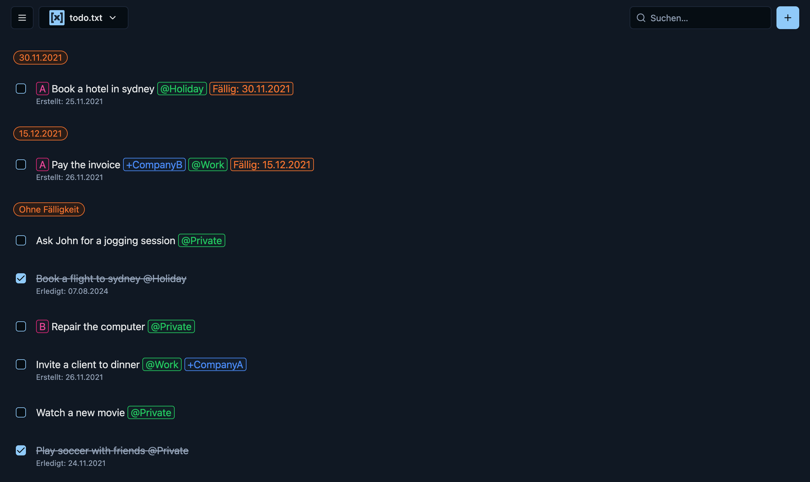
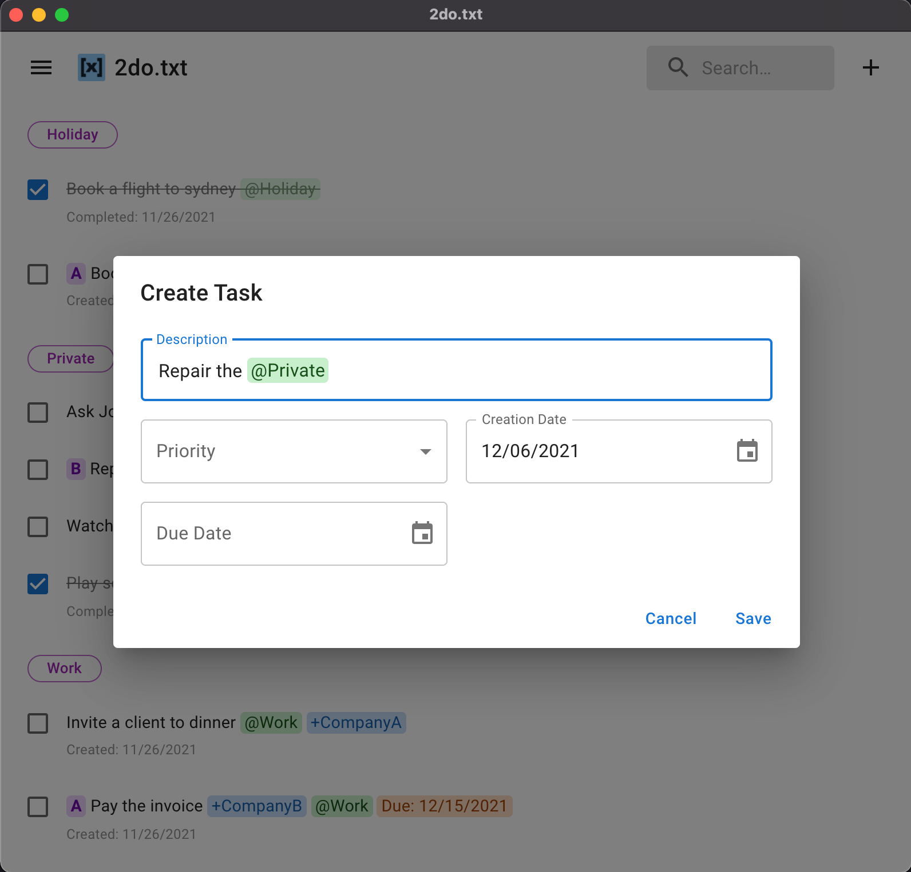
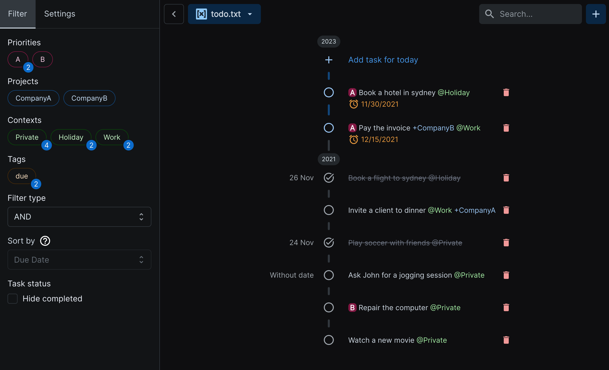

  

<h1 align="center">2do.txt</h1>

[![CI status][github-ci-action-image]][github-ci-action-url]
[![CodeQL status][github-codeql-analysis-action-image]][github-codeql-analysis-action-url]

[github-ci-action-image]: https://github.com/sodenn/2do-txt/actions/workflows/ci.yml/badge.svg
[github-ci-action-url]: https://github.com/sodenn/2do-txt/actions/workflows/ci.yml
[github-codeql-analysis-action-image]: https://github.com/sodenn/2do-txt/actions/workflows/codeql-analysis.yml/badge.svg
[github-codeql-analysis-action-url]: https://github.com/sodenn/2do-txt/actions/workflows/codeql-analysis.yml

**2do.txt** is a task management that uses the [todo.txt](https://github.com/todotxt/todo.txt) format. 2do.txt simplifies the work with todo.txt files by providing convenience functions such as sorting and filtering of tasks, autocomplete or notifications for due tasks.

  
  
  

## About todo.txt

The **todo.txt** format is a simple set of rules that make todo.txt both human and machine-readable. The format supports priorities, creation and completion dates, projects and contexts. For more information please see http://todotxt.org/.

## Features

- Filter tasks by projects, contexts, and tags
- Sort tasks by due date or priority
- Group tasks by context, projects or tags
- Hide completed tasks
- Search for tasks
- Shortcuts for the most important functions
- Due date notifications
- Supports working with multiple todo.txt files
- Autocompletion for projects, contexts and tags
- Archive completed tasks to done.txt
- Task recurrence (`rec:` tag)
- Dark mode
- Two different views: list and timeline
